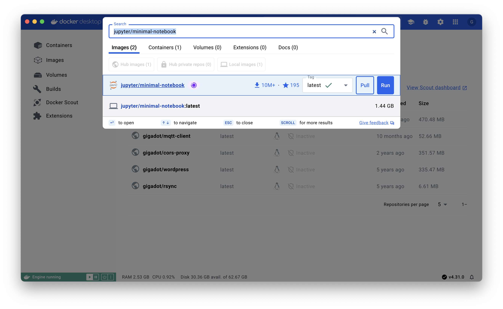
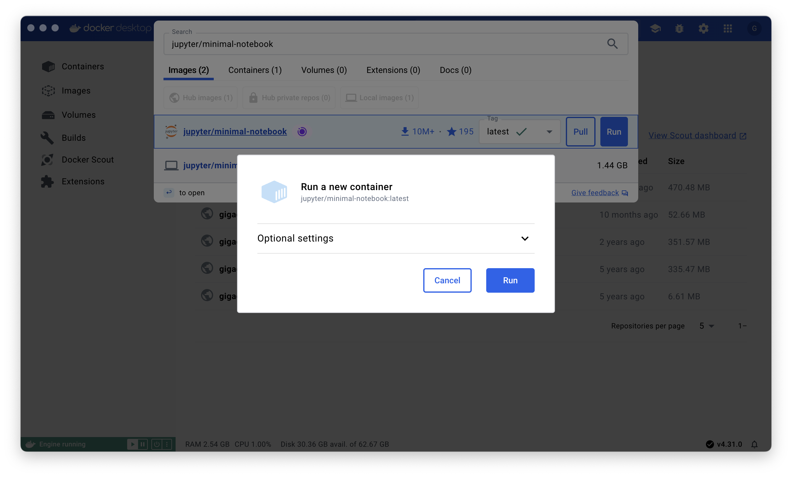
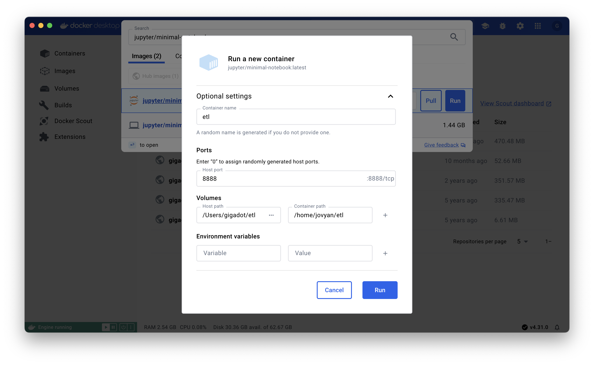
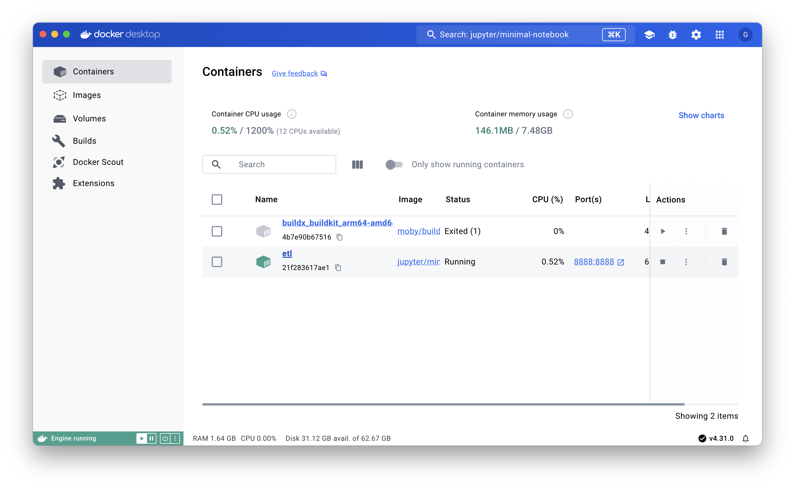
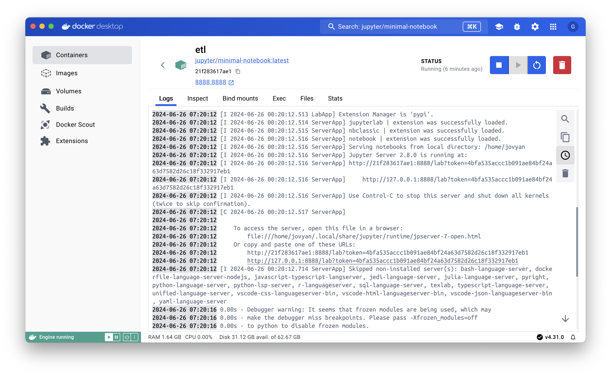

## Running Jupyter Notebooks in Dcoker
This is a simple guide to running Jupyter Notebooks in Docker. This guide assumes you have Docker installed on your machine. If you don't have Docker Desktop installed, you can download it [here](https://www.docker.com/products/docker-desktop).

### Step 1: Pull and Run the Jupyter Docker Image

### Step 2: Configure Jupyter Notebooks Docker Container

### Step 3: Map Port and Volume on Docker Container

### Step 4: Access Jupyter Notebooks in Browser

